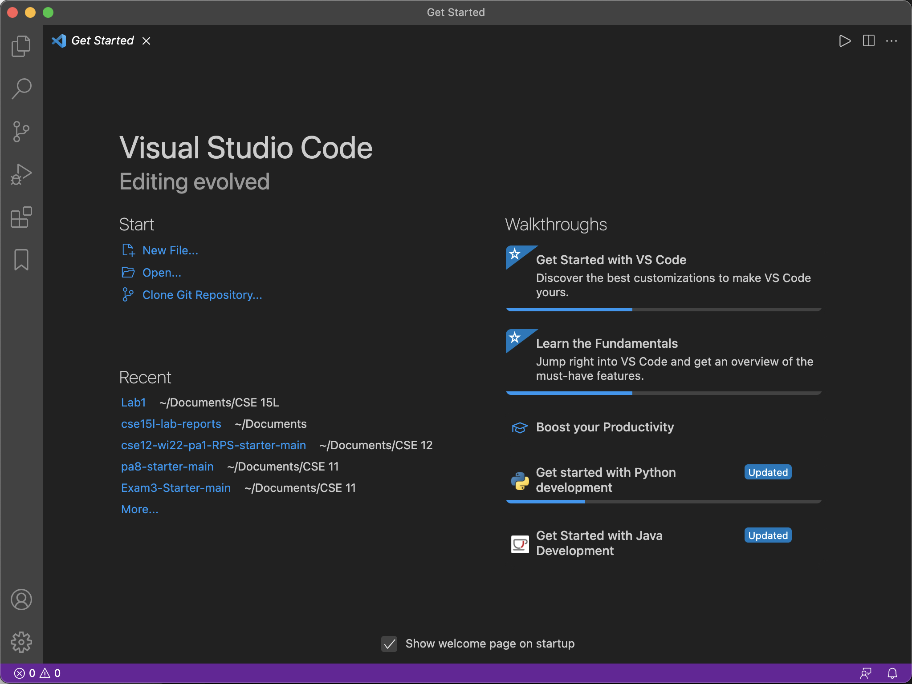
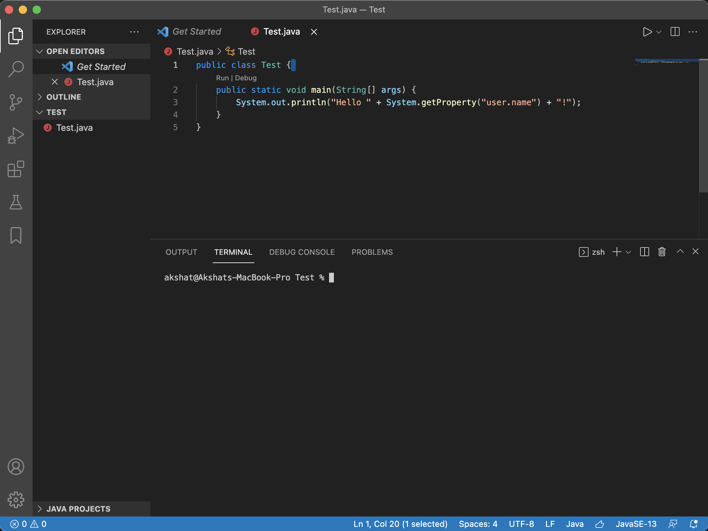
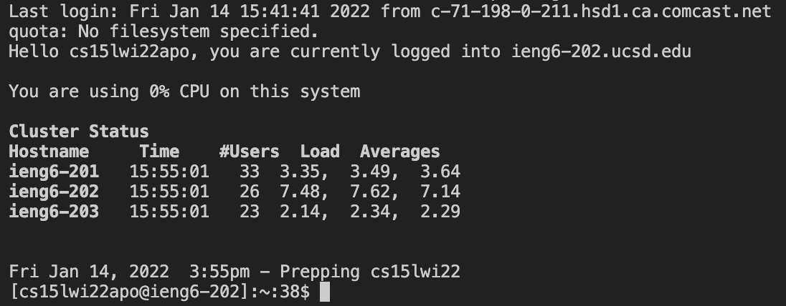
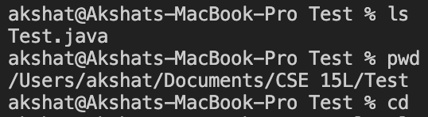
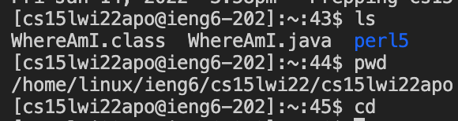
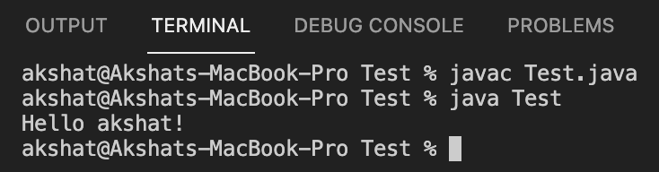
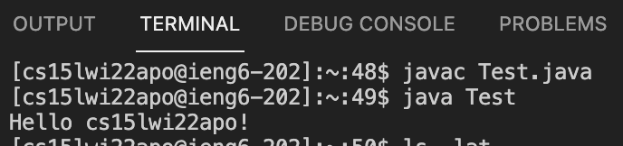
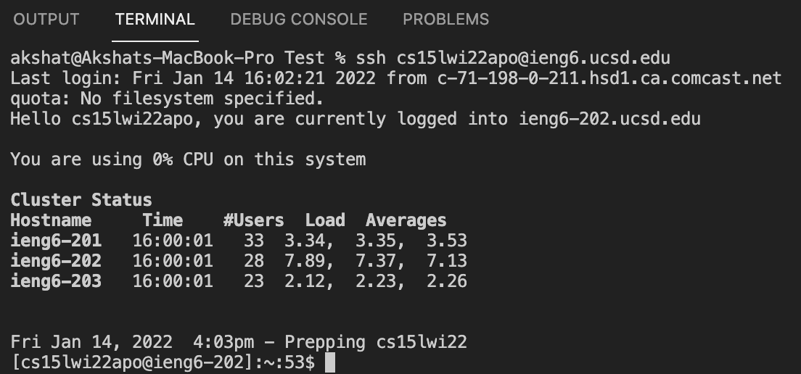
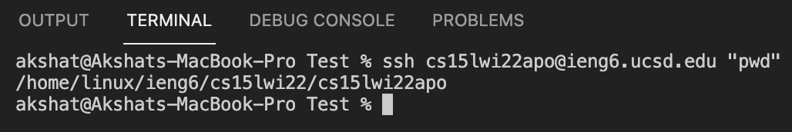

# Week 2 Lab Report

In this tutorial, you will be guided through all the steps necessary to be able to move files from your computer to your course-specific account on `ieng6` and optimize that process. This tutorial is specific to macOS.

It is assumed that you have installed a recent version of JDK on your Mac.

## Step 1: Installing and Setting Up VSCode

VSCode is the code editor that we will be using in this tutorial, for creating files and using its terminal for remote access.

1. Download VSCode for Mac from [here](https://code.visualstudio.com/download).


2. After installing VSCode, launch the application and you should see a window similar to the one in the image below (the colors/theme may be different).


3. Click on the Open... button and open any test folder. Right click under folder view in the left,and create a new Java file called Test.java. Copy paste the following code into the file:

```
public class Test {
    public static void main(String[] args) {
        System.out.println("Hello " + System.getProperty("user.name") + "!");
    }
}
```
4. Finally, in the menubar in the top left, click Terminal -> New Terminal to open up the terminal that you will be working in. Your window should look similar to this:


## Step 2: Remotely Connecting to ieng6

1. To connect to ieng6, you need to first find and set the password for your course specific account, which can be found [here](https://sdacs.ucsd.edu/~icc/index.php). Instructions for changing the password can be found on this [piazza post](https://piazza.com/class/kxs0toocqhv4og?cid=54).

2. To login remotely, enter the following command in the terminal:
```
$ ssh cs15lwi22zz@ieng6.ucsd.edu
```
Be sure to replace zz with the letters of your account.

3. If you're logging in for the first time, you may be prompted with a message asking if you're sure about connecting to the server. Simply type `yes` and hit enter.

4. After, you will be prompted with a message asking for your password. Enter your password (it will not be visible), and hit enter. You should now be logged in.


*If you are running into issues with the password, repeat step 1 to reset your password, and try again.*

## Step 3: Trying Commands

1. If you are still logged into the remote server, type exit and hit enter to leave the server.

2. Now, on your device (usually known as the client), test some of the commands listed below:
* ls
* pwd
* cd
* ls -lat  


3. Log into the remote server again using the ssh command and entering your password. This time, try the commands on the server and notice the differences. Afterwards, exit the server.


## Step 4: Moving Files with scp

An important part of interacting with a remote server is being able to tranfer files back and forth between the server and the client (your device). This can be done with the `scp` command, which copies your file over to the server.

1. The file we'll be moving is Test.java, but before we move the file, we should run it clientside. User `javac Test.java` to compile the file and then `java Test` to run the class.


2. Now, enter the following command into the terminal, with your specific course account:
```
$ scp Test.java cs15lwi22zz@ieng6.ucsd.edu:~/
```
You will be prompted with a password request, and after entering it, Test.java should be transferred over to the remote server.

3. Log in to your specific remote server, and then try to compile and run Test.java. It should print something different from when you ran it clientside.


## Step 5: Setting an ssh Key

Typing your password for every ssh and scp command gets annoying really quick. In this step, we will be placing a *public* file in the server and *private* file in the client that allow for a no-password login.

1. Clientside, type `ssh-keygen` into the terminal and follow the steps. For the file, copy the directory in the parentheses. Leave the passphrase empty and hit enter. It should look similar to the terminal code below:

```
akshat@Akshats-MacBook-Pro Lab1 % ssh-keygen
Generating public/private rsa key pair.
Enter file in which to save the key (/Users/akshat/.ssh/id_rsa): /Users/akshat/.ssh/id_rsa
Enter passphrase (empty for no passphrase): 
Enter same passphrase again: 
Your identification has been saved in /Users/akshat/.ssh/id_rsa.
Your public key has been saved in /Users/akshat/.ssh/id_rsa.pub.
The key fingerprint is:
SHA256:aPCY3b81d4K67lH1zHO8Yct4cqks0oscNI35V2uUCYg akshat@Akshats-MacBook-Pro.local
The key's randomart image is:
+---[RSA 3072]----+
|                 |
|          . .    |
|    .    E . ..  |
|     * o  +  ..=o|
|    o = S= ..  O*|
|     .  ..o. .* O|
|         .+.++oX.|
|        ..oBoo*o |
|         =Booo   |
+----[SHA256]-----+
```

2. Now, we will be adding the *public* file to the `.ssh` directory of the server. Login to the server and create a directory called .ssh
```
$ mkdir .ssh
```

3. Next, logout and on the clientside, copy the file over with the following command:

```
$ scp /Users/akshat/.ssh/id_rsa.pub cs15lwi22zz@ieng6.ucsd.edu:~/.ssh/authorized_keys
```

*Make sure to replace the user name and account name with your account.*

4. You should now be able to login to the remote server or copy files over without your password. Try it out, and if you run into any errors, delete the .ssh directory from the server with the command `$ rm .ssh`, and repeat all the steps in this section.


## Step 6: Optimizing Remote Running
Using ssh keys to remove the password requirement made it easier to log in to the server and copy files. However, there are more steps that can be taken to optimize this process. 

* One method I frequently use is clicking the up arrow key to navigate through old commands. This is handy for logging in/out of the server, or copying the same file after making edits to it.
* In the `ssh cs15lwi22zz@ieng6.ucsd.edu`, putting a command in quotes right after it excutes that command after logging in. For example `ssh cs15lwi22zz@ieng6.ucsd.edu "pwd"` would print the directory of the server after logging in.

* Separating commands with semicolons on one line executes the commands in order. For example: `javac Test.java; java Test`

Another method I discovered is to edit the .zshrc file of a mac. Instructions on editing this file can be found [here](https://stackoverflow.com/questions/36157663/editing-the-zshrc-file). In the .zshrc file, add this line with your specific account:
```
alias login15l="ssh cs15lwi22zz@ieng6.ucsd.edu"
```

Save the file. Now, whenever you open a new terminal, type this command:
```
source ~/.zshrc
```

Now, in this terminal session, you can log into the server simply by typing `login15l` and hitting enter!


That's it for this tutorial! Feel free to let me know of any errors that need to be corrected.


