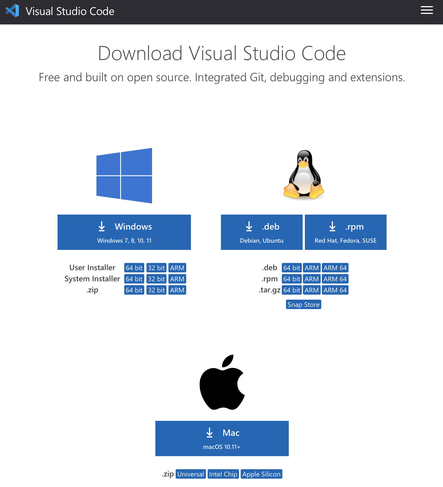

# Week 2 Lab Report

In this tutorial, you will be guided through all the steps necessary to be able to move files from your computer to your course-specific account on `ieng6` and optimize that process. This tutorial is specific to macOS.

It is assumed that you have installed a recent version of JDK on your Mac.

## Step 1: Installing and Setting Up VSCode

VSCode is the code editor that we will be using in this tutorial, for creating files and using its terminal for remote access.

1. Download VSCode for Mac from [here](https://code.visualstudio.com/download).


2. After installing VSCode, launch the application and you should see a window similar to the one in the image below (the colors/theme may be different).

3. Click on the Open... button and open any test folder. Right click under folder view in the left,and create a new Java file called Test.java. Copy paste the following code into the file:

```
public class Test {
    public static void main(String[] args) {
        System.out.println("Hello " + System.getProperty("user.name") + "!");
    }
}
```
4. Finally, in the menubar in the top left, click Terminal -> New Terminal to open up the terminal that you will be working in. Your window should look similar to this:
>IMAGE

## Step 2: Remotely Connecting to `ieng6`

1. To connect to ieng6, you need to first find and set the password for your course specific account, which can be found [here](https://sdacs.ucsd.edu/~icc/index.php). Instructions for changing the password can be found on this [piazza post](https://piazza.com/class/kxs0toocqhv4og?cid=54).

2. To login remotely, enter the following command in the terminal:
```
$ ssh cs15lwi22zz@ieng6.ucsd.edu
```
Be sure to replace zz with the letters of your account.

3. If you're logging in for the first time, you may be prompted with a message asking if you're sure about connecting to the server. Simply type yes and hit enter.

4. After, you will be prompted with a message asking for your password. Enter your password (it will not be visible), and hit enter. You should now be logged in.

>IMAGE

*If you are running into issues with the password, repeat step 1 to reset your password, and try again.*

