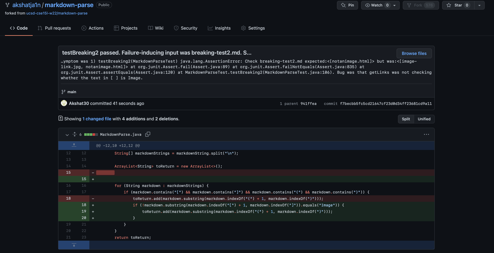
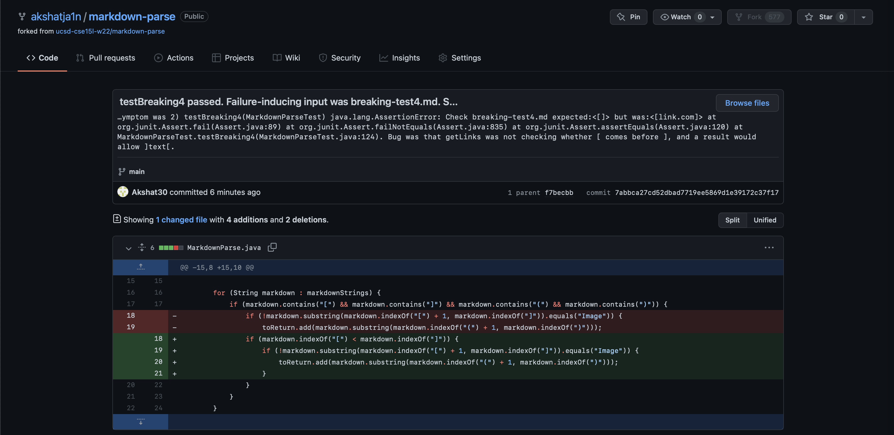
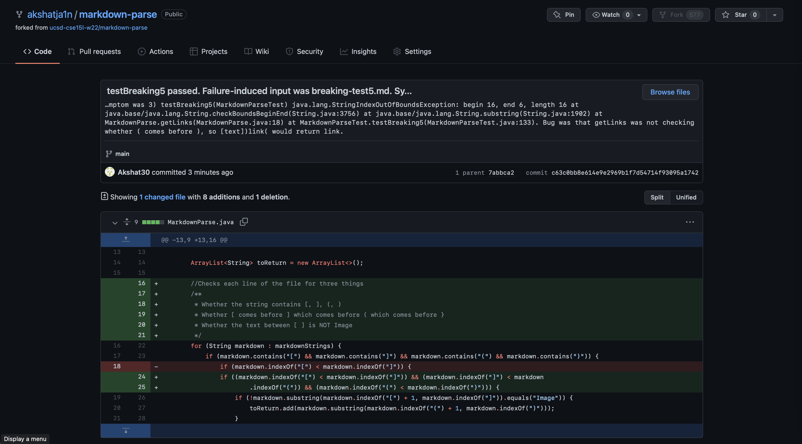

# Week 4 Lab Report

>For context, my code passed all of the test-files given by Prof. Politz, so I created my own test files that might've caused unexpected results. This is why the name of the files below is structured as breaking-test#.md.

## Code Change #1
___
### Code Change Diff Screenshot:




### Failure-inducing input file link:
[breaking-test2.md](https://github.com/akshatja1n/markdown-parse/blob/main/breaking-test2.md)

### Symptom of failure-inducing output:

```
1) testBreaking2(MarkdownParseTest)
java.lang.AssertionError: Check breaking-test2.md expected:<[notanimage.html]> but was:<[image-link.jpg, notanimage.html]>
        at org.junit.Assert.fail(Assert.java:89)
        at org.junit.Assert.failNotEquals(Assert.java:835)
        at org.junit.Assert.assertEquals(Assert.java:120)
        at MarkdownParseTest.testBreaking2(MarkdownParseTest.java:106)
```

### Explanation:
Taking a closer look at the file breaking-test2.md (failure-induced input), we can see that the display text of the first link says "Image." As a result, the corresponding link should not be returned by getLinks. However, the JUnit test failed, because my program returned the link regardless (symptom). The issue was that my program was not checking for the string "Image" in between the [ ] (bug), and the solution was to add an if statement checking for this. This can be seen in the code diff screenshot above.

<br>

<br>

## Code Change #2
___

### Code Change Diff Screenshot:




### Failure-inducing input file link:
[breaking-test4.md](https://github.com/akshatja1n/markdown-parse/blob/main/breaking-test4.md)

### Symptom of failure-inducing output:

```
2) testBreaking4(MarkdownParseTest)
java.lang.AssertionError: Check breaking-test4.md expected:<[]> but was:<[link.com]>
        at org.junit.Assert.fail(Assert.java:89)
        at org.junit.Assert.failNotEquals(Assert.java:835)
        at org.junit.Assert.assertEquals(Assert.java:120)
        at MarkdownParseTest.testBreaking4(MarkdownParseTest.java:124)
```

### Explanation:
Taking a closer look at the file breaking-test4.md (failure-induced input), we can see that the square brackets are switched, ]text[. As a result, the corresponding link should not be returned by getLinks, since the syntax is incorrect. However, the JUnit test failed, because my program returned the link regardless (symptom). The issue was that my program was not checking for whether [ comes before ] in the string (bug), and the solution was to add an if statement checking for this. This can be seen in the code diff screenshot above.

<br>

<br>

## Code Change #3
___

### Code Change Diff Screenshot:




### Failure-inducing input file link:
[breaking-test5.md](https://github.com/akshatja1n/markdown-parse/blob/main/breaking-test5.md)

### Symptom of failure-inducing output:

```
3) testBreaking5(MarkdownParseTest)
java.lang.StringIndexOutOfBoundsException: begin 16, end 6, length 16
        at java.base/java.lang.String.checkBoundsBeginEnd(String.java:3756)
        at java.base/java.lang.String.substring(String.java:1902)
        at MarkdownParse.getLinks(MarkdownParse.java:18)
        at MarkdownParseTest.testBreaking5(MarkdownParseTest.java:133)
```

### Explanation:
Taking a closer look at the file breaking-test5.md (failure-induced input), we can see that the parentheses are switched, )link(. As a result, the link should not be returned by getLinks, since the syntax is incorrect. However, the JUnit test failed, because my program returned link regardless (symptom). The issue was that my program was not checking for whether ( comes before ) in the string (bug), and the solution was to add an if statement checking for this. This can be seen in the code diff screenshot above.

In addition, this bug prompted me to check for whether [] comes before (), since a line formatted along the lines of (text)[link] could cause an unexpected output.
