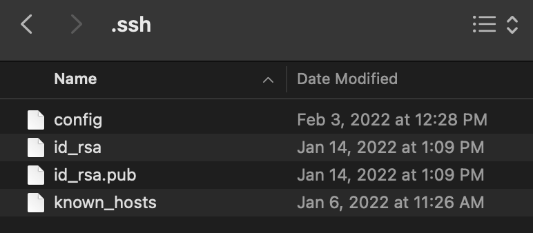
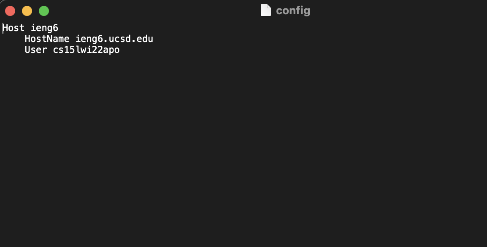
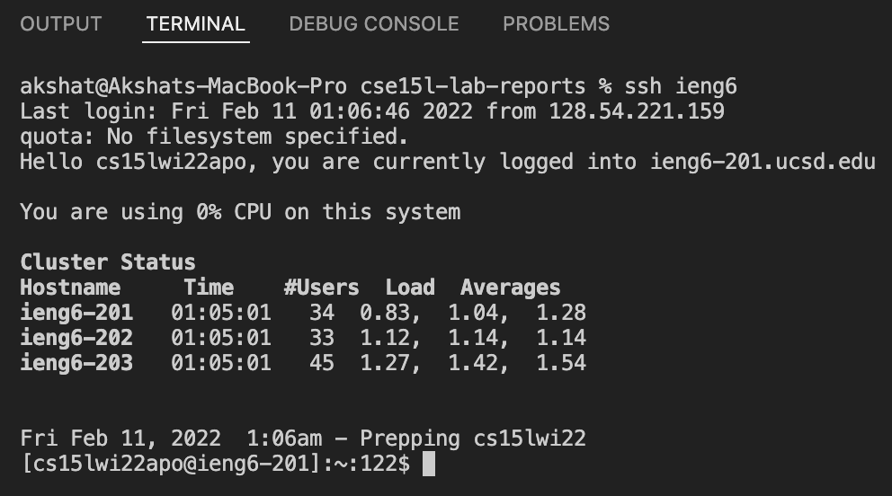
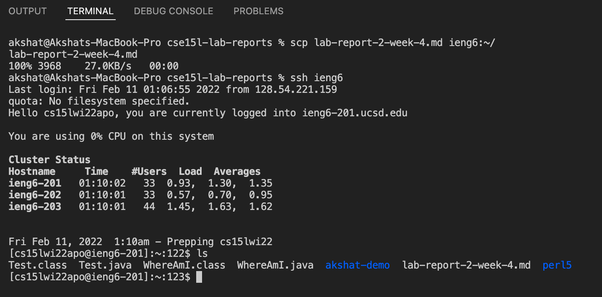

# Week 6 Lab Report
 
My lab report is about Streamling ssh Configuration.

## My .ssh/config File

I first went to the .ssh directory on my mac and created a new file called config, since it didn't already exist.



<br>

Then, I opened the file through text edit and added the commands making ieng6 a shortcut for my account name.



<br>

## My ssh command

After saving the config file, I was able to log into ieng6 simply using the following command. This is a lot more covenient.

```
ssh ieng6
```



<br>

## My scp command

After saving the config file, I was able to copy over a file to my account's remote server with ease. In the following image, I copy the markdown file of the previous lab report to the server.




