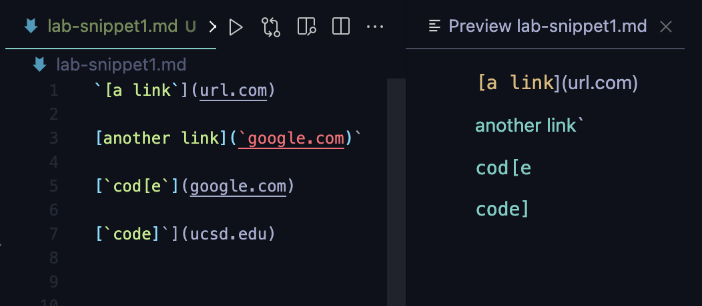
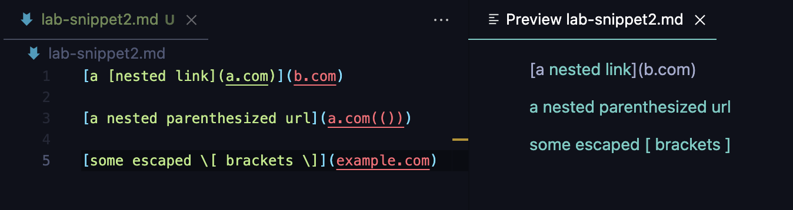
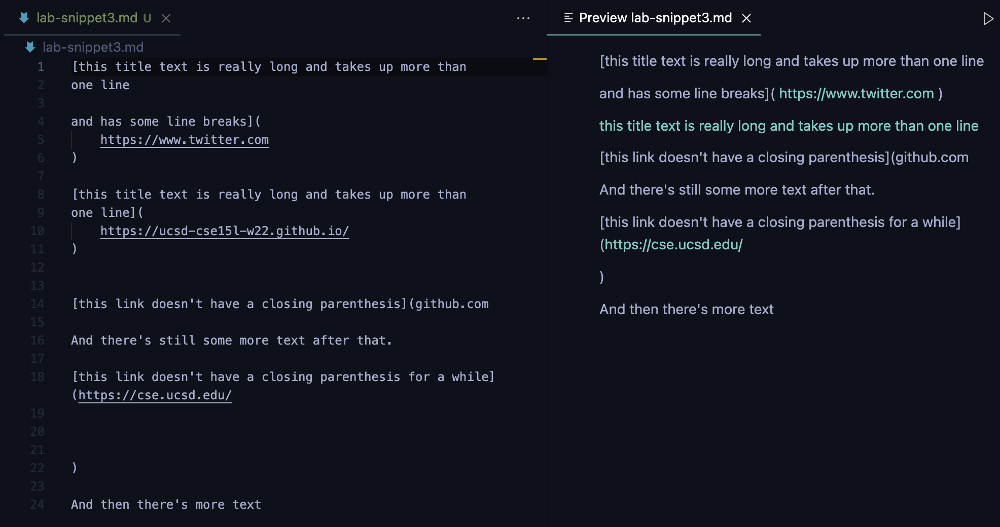

# Week 8 Lab Report

## MarkdownParse Repositories

[My MarkdownParse repository](https://github.com/akshatja1n/markdown-parse)

[Reviewed MarkdownParse repository](https://github.com/JaredJose/markdown-parse)

## Snippet 1

### Expected Output
Should return a List with the elements:

["`google.com", "google.com", "ucsd.edu"]


>Notice that the three valid links are the text in cyan

### Test Code
The test method from my MarkdownParseTest.java:
```
@Test
public void testSnippet1() throws IOException {
    String fileToTest = "lab-snippet1.md";

    List<String> expected = List.of("`google.com", "google.com", "ucsd.edu");

    assertEquals("Check " + fileToTest, expected, MarkdownParse.getLinks(readFile(fileToTest)));
}
```

### Output for My Implementation
Test failed.
Output:

```
1) testSnippet1(MarkdownParseTest)
java.lang.AssertionError: Check lab-snippet1.md expected:<[`google.com, google.com, ucsd.edu]> but was:<[url.com, `google.com, google.com, ucsd.edu]>
        at org.junit.Assert.fail(Assert.java:89)
        at org.junit.Assert.failNotEquals(Assert.java:835)
        at org.junit.Assert.assertEquals(Assert.java:120)
        at MarkdownParseTest.testSnippet1(MarkdownParseTest.java:151)
```

### Output for Reviewed Implementation
Test failed.
Output:

```
1) testSnippet1(MarkdownParseTest)
java.lang.AssertionError: Check lab-snippet1.md expected:<[`google.com, google.com, ucsd.edu]> but was:<[url.com, `google.com, google.com]>
        at org.junit.Assert.fail(Assert.java:89)
        at org.junit.Assert.failNotEquals(Assert.java:835)
        at org.junit.Assert.assertEquals(Assert.java:120)
        at MarkdownParseTest.testSnippet1(MarkdownParseTest.java:78)
```


## Snippet 2

### Expected Output
Should return a List with the elements:

["a.com", "a.com(())", "example.com"]


>Notice that the three valid links are the text in cyan

### Test Code
The test method from my MarkdownParseTest.java:
```
@Test
public void testSnippet2() throws IOException {
    String fileToTest = "lab-snippet2.md";

    List<String> expected = List.of("a.com", "a.com(())", "example.com");

    assertEquals("Check " + fileToTest, expected, MarkdownParse.getLinks(readFile(fileToTest)));
}
```

### Output for My Implementation
Test failed.
Output:

```
2) testSnippet2(MarkdownParseTest)
java.lang.AssertionError: Check lab-snippet2.md expected:<[a.com, a.com(()), example.com]> but was:<[a.com, a.com((, example.com]>
        at org.junit.Assert.fail(Assert.java:89)
        at org.junit.Assert.failNotEquals(Assert.java:835)
        at org.junit.Assert.assertEquals(Assert.java:120)
        at MarkdownParseTest.testSnippet2(MarkdownParseTest.java:160)
```


### Output for Reviewed Implementation
Test failed.
Output:

```
2) testSnippet2(MarkdownParseTest)
java.lang.AssertionError: Check lab-snippet2.md expected:<[a.com, a.com(()), example.com]> but was:<[a.com, a.com((]>
        at org.junit.Assert.fail(Assert.java:89)
        at org.junit.Assert.failNotEquals(Assert.java:835)
        at org.junit.Assert.assertEquals(Assert.java:120)
        at MarkdownParseTest.testSnippet2(MarkdownParseTest.java:87)
```


## Snippet 3

### Expected Output
Should return a List with the elements:

["https://ucsd-cse15l-w22.github.io/"]


>Notice that the only valid "link" is the cyan text that is not an actual link

### Test Code
The test method from my MarkdownParseTest.java:
```
@Test
public void testSnippet3() throws IOException {
    String fileToTest = "lab-snippet3.md";

    List<String> expected = List.of("https://ucsd-cse15l-w22.github.io/");

    assertEquals("Check " + fileToTest, expected, MarkdownParse.getLinks(readFile(fileToTest)));
}
```

### Output for My Implementation
Test failed.
Output:

```
3) testSnippet3(MarkdownParseTest)
java.lang.AssertionError: Check lab-snippet3.md expected:<[https://ucsd-cse15l-w22.github.io/]> but was:<[]>
        at org.junit.Assert.fail(Assert.java:89)
        at org.junit.Assert.failNotEquals(Assert.java:835)
        at org.junit.Assert.assertEquals(Assert.java:120)
        at MarkdownParseTest.testSnippet3(MarkdownParseTest.java:169)
```


### Output for Reviewed Implementation
Test failed.
Output:

```
3) testSnippet3(MarkdownParseTest)
java.lang.AssertionError: Check lab-snippet3.md expected:<[https://ucsd-cse15l-w22.github.io/]> but was:<[
    https://www.twitter.com
, 
    https://ucsd-cse15l-w22.github.io/
, github.com

And there's still some more text after that.

[this link doesn't have a closing parenthesis for a while](https://cse.ucsd.edu/


]>
        at org.junit.Assert.fail(Assert.java:89)
        at org.junit.Assert.failNotEquals(Assert.java:835)
        at org.junit.Assert.assertEquals(Assert.java:120)
        at MarkdownParseTest.testSnippet3(MarkdownParseTest.java:96)
```

## Analysis

### Snippet 1


### Snippet 2


### Snippet 3
